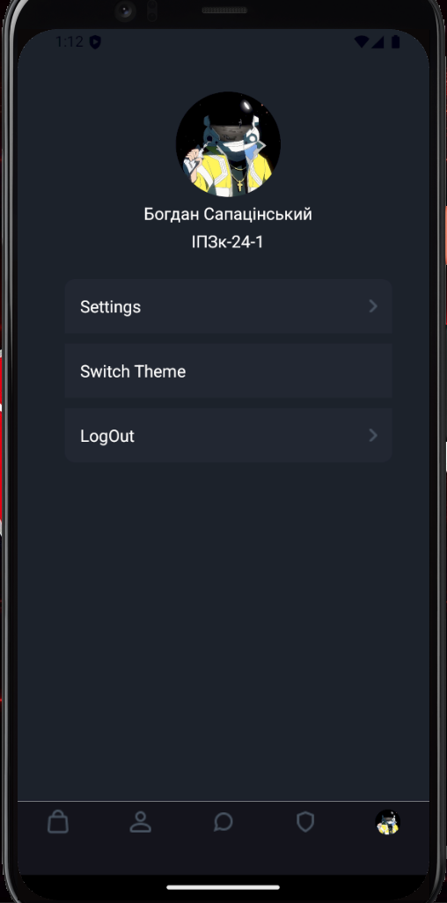
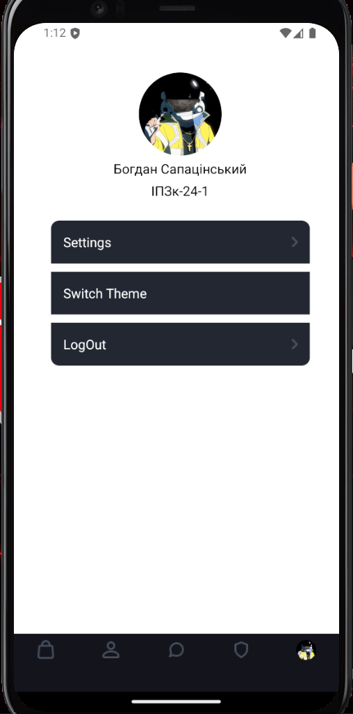

**Інструкція з запуску**
1) Клонувати проект
2) Запустити емулятор Android (якщо він ще не запущений).
3) У середовищі розробки відкрити термінал.
4) У терміналі ввести команду: npm run android
5) Якщо зявляється помилки довантажити бібліотеки, яких не вистачає.
6) Серед запропоновваних варіантів вибрати >a - запуск на андроїд емуляторі
   
**Щоб перемкнути стилі, потрібно перейти на сторінку profile**

**А потім натиснути на Switch Theme**

